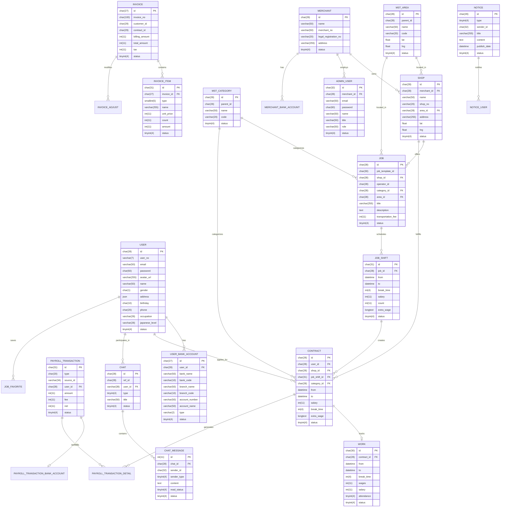

# Entity-Relationship Diagram

The following diagram represents the database schema for the Pirago application.

## Database Flow

The Pirago application demonstrates the following main flows:

1. **User Management Flow**:
   - Users register and maintain profiles
   - Users can update their bank accounts for payment
   - Admin users manage the platform on behalf of merchants

2. **Job Posting Flow**:
   - Merchants create shops
   - Shops post jobs with specific categories and locations
   - Jobs contain shifts with time and salary details
   - Users can favorite jobs they're interested in

3. **Contract Flow**:
   - Users apply for job shifts
   - Contracts are created when applications are accepted
   - Work records track actual attendance and performance
   - Shop and user reviews are logged after completion

4. **Payment Flow**:
   - Invoices are generated for completed contracts
   - Invoice items detail the charges
   - Payroll transactions process payments to users
   - Bank account information is used for transfers

5. **Communication Flow**:
   - Chat functionality between users and shops/admin
   - Notices provide platform-wide or targeted information
   - Messages are tracked for read status

This database schema supports a comprehensive job marketplace platform where users can find temporary jobs, merchants can manage their workforce needs through shops, and the platform facilitates the entire process from job posting to payment processing. 