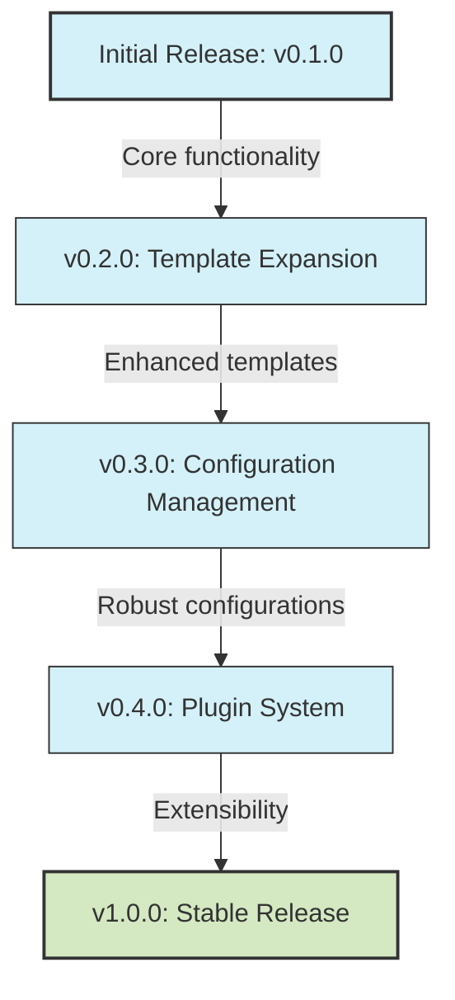

# PAI Tool Roadmap

## Vision
Create a user-friendly command-line tool that streamlines project initialization and management by providing standardized templates, configurations, and workflows.

## Strategic Direction

## Milestones

### v0.1.0 (MVP)
- Core command structure (`pai init`, `pai version`, etc.)
- Basic template initialization
- Documentation for basic usage

### v0.2.0
- Expanded template library
- Custom template support
- Template versioning

### v0.3.0
- Advanced configuration management
- User preferences
- Project-specific configurations

### v0.4.0
- Plugin system for extensibility
- Community contributions framework
- API for third-party integrations

### v1.0.0
- Full test coverage
- Comprehensive documentation
- Performance optimizations
- Stable API

## Success Metrics
- User adoption rate
- Time saved during project initialization
- Number of community contributions
- User satisfaction ratings
